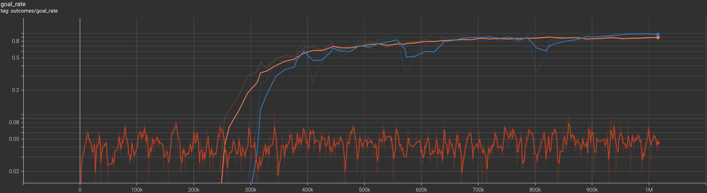
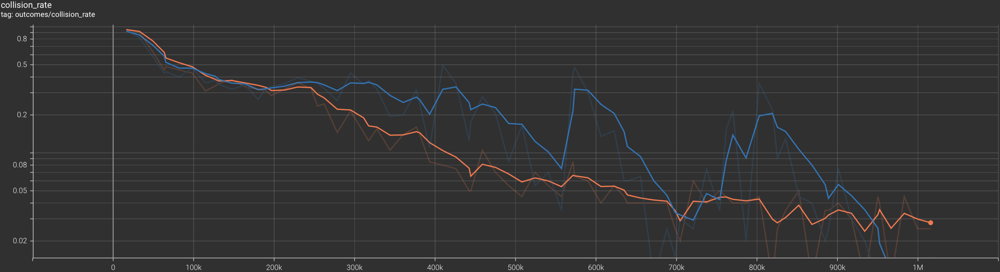
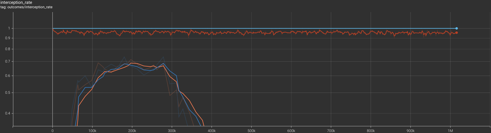
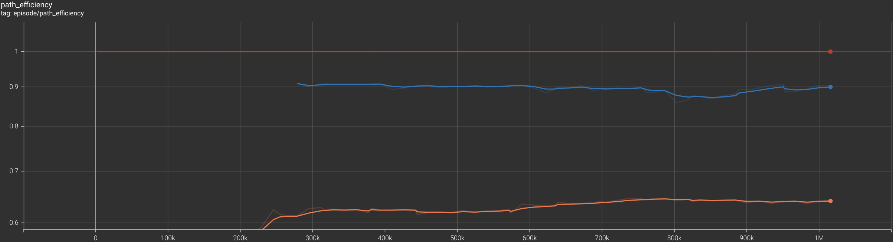

# Breaking Ankles with RL

---

## Video

<iframe width="560" height="315" src="https://www.youtube.com/embed/9dfKkI4hmZ8?si=EOYuVOcZ_PDa34vs" title="YouTube video player" frameborder="0" allow="accelerometer; autoplay; clipboard-write; encrypted-media; gyroscope; picture-in-picture; web-share" referrerpolicy="strict-origin-when-cross-origin" allowfullscreen></iframe>

---

## Project Summary

Breaking Ankles with RL is a reinforcement-learning project studying reactive avoidance in a two-dimensional gridworld. In our problem setup, an agent with partial observability navigates from some starting location to some goal location while avoiding static obstacles and dynamic "seekers". Each seeker attempts to move in a manner according to some predetermined policy; each seeker may attempt to move randomly, greedily (minimizing some distance metric to the agent), or A\*-like (moving along the shortest path to the agent as calculated by the A\* pathfinding algorithm). Both the agent and the seekers traverse the gridworld at some constant velocity. A single episode terminates when the agent reaches the goal location, when the agent collides with an obstacle, seeker, or the grid boundaries, when a seeker intercepts the agent, or when a time limit is reached. The agent’s training objective is to learn a policy that balances goal-oriented navigation with real-time evasive maneuvers. The overarching goal of our project is to develop a reinforcement learning framework that facilitates long-term autonomous navigation amidst short-term safety constraints.

We implement a configurable training environment in Python using Gymnasium, a popular open-source library for representing reinforcement learning problems. We use Minigrid, an extension of the Gymnasium ecosystem with configurable gridworld environments, to assist in rendering our training environment. The training environment operates in discrete time steps. At each discrete time step, the agent receives an observation of the environment state and a scalar reward generated by a custom reward function. The agent’s observation of the environment state is a one-dimensional vector encoding information about the agent’s global location, the relative position of the goal location, and the relative positions of nearby occluded cells, out-of-bounds cells, visible obstacles, and visible seekers stacked over the last five discrete time steps. Using the Proximal Policy Optimization (PPO) algorithm, our agent learns a mapping between its observation vector and a probability distribution over nine actions. The agent samples from the probability distribution to output one of nine possible actions: no movement or movement along one of eight directions (front, right, back, left, front-right, back-right, back-left, and front-left). After the agent performs its action in the environment, the environment transitions to its next state.

We provide a visual representation (rendered by Minigrid) of our training environment below:

Our training environment is a 30-by-30 gridworld consisting of static obstacles scattered throughout the gridworld. The agent is placed at (28, 1), and the two seekers are placed at (3, 17) and (16, 27). The goal location is placed at (0, 28). As highlighted in faint gray, the agent has a visibility radius of three cells.

Our project is directly related to real-world autonomous navigation tasks in dynamic and uncertain environments, where an agent must make progress towards a long-term objective while responding to immediate safety risks. In domains like robotic exploration and search-and-rescue, agent success depends not only on whether it can reach the goal location, but also whether it can reach the goal location safely under partial observability. Our project isolates this challenge into a gridworld setting: our environment incorporates both static and dynamic hazards, and our agent operates under partial observability.

What makes this problem non-trivial is the tension between two competing objectives: reaching the goal location in as few time steps as possible and avoiding threats to the agent. The agent must simultaneously reason about long-term goal achievement and short-term reactive avoidance. Because seekers can move according to distinct (and sometimes non-deterministic) policies, the agent cannot simply apply a handcrafted policy and must actively adapt to dynamic threats. Partial observability further compounds the problem’s difficulty: the agent cannot rely on full knowledge of the environment state and must instead infer danger from limited local observations and recent temporal history. These constraints make straightforward heuristics alone insufficient: a greedy navigation strategy, for example, does not account for seeker behavior, while a conservative navigation strategy may idle or timeout. These constraints, therefore, necessitate the use of reinforcement learning.

---

## Approach

### Environment Setup

Our training pipeline accepts as input a YAML configuration file containing several environment hyperparameters that determine the configuration of the training environment. In particular, the YAML configuration file contains ten environment hyperparameters: the gridworld dimensions, the static obstacles’ locations, the episode time limit, the agent’s start and goal locations, the agent’s velocity, the agent’s visibility radius, the agent’s memory depth (discussed in the subsequent paragraphs), the seekers’ start locations, and the seekers’ velocities. Given this configuration file, the pipeline produces a corresponding training environment.

We implement this configurable training environment in Python using Gymnasium, a popular open-source library for representing reinforcement learning problems. We use Minigrid, an extension of the Gymnasium ecosystem with configurable gridworld environments, to assist in rendering our training environment. The training environment operates in discrete time steps. At each discrete time step, the agent receives an observation of the environment state and a scalar reward generated by a custom reward function.

At each time step, the environment state consists of the environment hyperparameters listed above, the agent’s current location, and the seekers’ current locations. The agent’s observation of the environment state is a one-dimensional vector encoding information about the agent’s global location, the relative position of the goal location, and the agent’s most recent local observations. The agent’s local observation of the environment state at some time step is itself a one-dimensional vector encoding information about nearby occluded cells, out-of-bounds cells, visible obstacles, and visible seekers. The agent’s memory depth determines the number of recent local observations to encode in the agent’s observation of the environment state. In our YAML configuration file, the agent’s memory depth is set to five: the agent’s observation of the environment state encodes the five most recent local observations.

#### Reward Function

At each time step, the agent receives a scalar reward generated by a custom reward function defined as follows:

$$
R(t) = R_{terminated}(t) + R_{progress}(t) − R_{danger}(t) − R_{nonprogress}(t) − R_{step}
$$

We explain each term of the reward function below.

$\mathbf{R_{terminated}(t)}$**: the terminal environment state reward term**

The terminal environment state reward term rewards or penalizes the agent for entering a terminal environment state. Specifically, the term evaluates to:
- $0$ if the environment state at time step $t$ is not terminal 
- $5$ if the agent reached the goal location at time step $t$
- $-5$ if at time step $t$:
    - the agent collided with an obstacle, a seeker, or the grid boundaries
    - a seeker intercepts the agent
    - the episode time limit is reached

$\mathbf{R_{progress}(t)}$**: the goal progress reward term**

The goal progress reward term rewards progress towards the goal and penalizes regression from the goal. Specifically, we define the term as follows:

$$
R_{progress}(t) = c_{progress}(t−1) * (d_{goal}(t−1) − d_{goal}(t))
$$

The $c_{progress}(t - 1)$ term is a positive coefficient associated with the goal progress reward term. This term evaluates to:
- $0.05$ if the agent can see a seeker before it moves at time step $t - 1$
- $0.1$ otherwise

The $d_{goal}(t)$ term represents the agent's minimum number of time steps to reach the goal location given the environment state at time step $t$.

The expression $d_{goal}(t−1) − d_{goal}(t)$ evaluates to:
- $>0$ if the agent has progressed towards the goal location
- $<0$ if the agent has regressed from the goal location
- $0$ if the agent has neither progressed nor regressed from the goal location

Note that we define $R_{progress}(0) = 0$.

$\mathbf{R_{danger}(t)}$**: the proximity penalty term**

The proximity penalty term penalizes the agent for close proximity to seekers. Specifically, we define the term as follows:

$$
R_{danger}(t) = \sum_{s \in VS(t)}(c_{danger} * (1 - d(a(t), s) / a_{\text{visibility_radius}}))
$$

The $VS(t)$ term represents the set of coordinates corresponding to seekers visible to the agent at time step $t$.

The $c_{danger}$ term is a positive coefficient associated with the proximity penalty term. This term defaults to $0.01$.

The $d(a(t), s)$ term is the distance between the agent's coordinates and a visible seeker's coordinates at time step $t$ according to some distance metric $t$. The distance metric defaults to the Chebyshev distance.

The $a_{\text{visibility_radius}}$ term is the agent's visibility radius. This term defaults to $3$ in the YAML configuration file.

For each visible seeker at time step $t$, the agent receives up to $c_{danger}$ in penalties, scaled linearly with respect to the agent’s distance to the visible seeker.

$\mathbf{R_{nonprogress}(t)}$**: the non-progress penalty term**

The non-progress penalty term penalizes the agent for not making progress towards the goal location when safe. Specifically, the term evaluates to:
- $0$ if $l_{nonprogress}(t) = 0$
- $b_{nonprogress} + c_{nonprogress} * \text{min}(l_{nonprogress}(t), max_{nonprogress})$ otherwise

The $l_{nonprogress}(t)$ term represents the number of consecutive penalizable non-progressive actions immediately before time step $t$. We say an action at time step $t$ is non-progressive if the action does not reduce the minimum number of time steps to the goal location. We say a non-progressive action at time step $t$ is penalizable if the agent cannot see any seekers at time step $t$.

The $b_{nonprogress}$ term is a bias associated with the $R_{nonprogress}(t)$ term (defaulted to $0.025$).

The $c_{nonprogress}$ term is a positive coefficient associated with the $R_{nonprogress}(t)$ term (defaulted to $0.005$).

The $max_{nonprogress}$ term is a constant associated with the $R_{nonprogress}(t)$ term representing the maximum number of consecutive penalizable non-progressive actions to punish for.

$R_{step}$: the step penalty term

The step penalty term penalizes the agent for time inefficiency. Specifically, we define the term as the constant $0.01$.

#### Action Space

Given the agent’s observation of the environment state, the agent outputs a probability distribution over nine actions. The agent samples from the probability distribution to output one of the nine actions: no movement or movement along one of eight directions (front, right, back, left, front-right, back-right, back-left, and front-left).

#### Environment Dynamics

After the agent performs its action in the environment, the environment transitions to its next state by moving each seeker according to its policy.

Each seeker employs one of three policies:

- **Random**: the seeker moves randomly (ties broken at random)
- **Greedy**: the seeker moves in a manner minimizing some distance metric to the agent
- **A\***: the seeker moves along the shortest path to the agent as calculated by the A\* pathfinding algorithm

We list the full set of environment hyperparameter values stored in the YAML configuration file (excluding the agent’s start and goal locations, the seekers’ start locations, and the obstacles’ locations) below. Our training environment employs two seekers.

| Parameter | Value |
|---|---|
| Gridworld Dimensions | 30 x 30 |
| Episode Time Limit | 120 |
| Agent Velocity | 1 cell / time step |
| Agent Visibility Radius | 3 cells |
| Agent Memory Depth | 5 local observations |
| Seeker Velocity | 1 cell / time step |

### Algorithm
We train our agent via the Proximal Policy Optimization (PPO) algorithm, an on-policy actor-critic method. In particular, we employ the implementation provided by the Stable Baselines3 library. At a high level, like any other policy gradient method, the algorithm operates by 1) collecting trajectories sampled using the current policy, 2) performing several mini-batch gradient updates using those trajectories, and 3) discarding the collected trajectories before repeating the above process [1]. A trajectory consists of a sequence of transitions collected under the current policy. Each transition typically consists of an observation $o(s_t)$, the reward $r_t$, the sampled action $a_t$, and the next observation $o(s_{t+1})$. PPO uses these trajectories to compute value targets and advantage estimates, providing data for policy updates.

PPO differs from more basic policy gradient methods by constraining how much the policy may change with each mini-batch gradient update. Specifically, PPO uses a clipped surrogate objective function to discourage large policy updates.

Let $r_t(\theta) = \pi_\theta(a_t \mid s_t) / \pi_{\theta_{\mathrm{old}}}(a_t \mid s_t)$ represent the probability ratio between the new and old policies. Let $\hat{A}_t$ represent the estimated advantage. The clipped policy loss is given by $L^{\text{clip}}(\theta) = \mathbb{E}_t\left[\min\left(r_t(\theta)\hat{A}_t,\; \mathrm{clip}(r_t(\theta), 1-\epsilon, 1+\epsilon)\hat{A}_t\right)\right]$. PPO also trains a value function (typically via squared-error loss), and PPO often includes an entropy bonus to encourage exploration.

### Training Hyperparameters
We train our agent for 1,015,808 interaction steps. We list the default hyperparameter values for the Stable-Baselines3 implementation of the PPO algorithm below [2]:

| Hyperparameter | Value |
|---|---|
| learning_rate | 0.0003 |
| n_steps | 2048 |
| batch_size | 64 |
| n_epochs | 10 |
| gamma | 0.99 |
| gae_lambda | 0.95 |
| clip_range | 0.2 |
| clip_range_vf | None |
| normalize_advantage | True |
| ent_coef | 0.0 |
| vf_coef | 0.5 |
| max_grad_norm | 0.5 |
| use_sde | False |
| sde_sample_freq | -1 |
| rollout_buffer_class | None |
| rollout_buffer_kwargs | None |
| target_kl | None |

We tuned our hyperparameters manually based on the agent’s goal rate curve. To improve convergence near the end of training, we employed a linear learning rate scheduler from 0.0003 to 0.0001. To encourage the agent to explore various policies and to prevent premature convergence, we increased the entropy regularization coefficient from 0.0 to 0.005.

### References:
[1] J. Schulman, F. Wolski, P. Dhariwal, A. Radford, and O. Klimov, “Proximal Policy Optimization Algorithms,” Aug. 2017. Available: https://arxiv.org/pdf/1707.06347

[2] Stable Baselines3, “PPO — Stable Baselines3 1.4.1a3 documentation,” stable-baselines3.readthedocs.io, Mar. 18, 2026. https://stable-baselines3.readthedocs.io/en/master/modules/ppo.html

---

## Evaluation

We evaluate whether PPO learns a reactive avoidance policy that can successfully reach the goal location in the presence of dynamic seekers. We compare the PPO agent against a deterministic partially observable A\* baseline. In all experiments, the objective is the same: the agent must navigate to a goal location while avoiding two seekers. We consider two seeker behaviors: a greedy policy minimizing Chebyshev distance to the agent and an A\*-based policy minimizing path distance to the agent.

In total, we perform four experiments: the PPO agent vs. greedy seekers, the PPO agent vs. A\* seekers, the baseline agent vs. greedy seekers, and the baseline agent vs. A\* seekers.

The training pipeline monitors performance, saves the best checkpoints, and records videos before, during, and after training.

### Quantitative Evaluation

For quantitative evaluation, we track five metrics: goal rate (percentage of episodes where the agent reaches the goal), collision rate (percentage of episodes where the agent collides with an obstacle, a seeker, or a boundary), interception rate (percentage of episodes where a seeker intercepts the agent), timeout rate (percentage of episodes that exhaust the step limit), and path efficiency (the ratio between the minimum number of time steps required to progress from the starting location to the goal location and the actual number of time steps taken). Goal rate is the primary success metric: we consider the task solved only when the agent actually reaches the goal location. Collision rate, interception rate, and timeout rate measure failure modes and capture the safety and robustness of the policy. Path efficiency measures how direct successful trajectories are. We use path efficiency as a secondary success metric. Note that agents may have high path efficiency while failing most episodes overall; as such, we consider goal rate and failure rates as more important than path efficiency when judging an agent's performance on the task.

In all subsequent figures, the orange line corresponds to the PPO agent vs. greedy seekers, the dark blue line corresponds to the PPO agent vs. A\* seekers, the red line corresponds to the baseline agent vs. greedy seekers, and the light blue line corresponds to the baseline agent vs. A\* seekers. All values discussed are smoothed (per TensorBoard defaults).

The goal rate curve demonstrates that PPO substantially improves over the course of training. Early in training, from time step 0 to time step 245,000, the PPO agent achieves a 0% goal rate against both greedy seekers and A\* seekers. We expect this behavior, as the policy is initially close to random. As training progresses, goal rate increases sharply. From time step 245,000 to 444,000, the PPO agent's goal rate **increases from 0% to 69.50%** against greedy seekers; from time step 262,000 to 393,000, the PPO agent's goal rate **increases from 0% to 60.65%** against A\* seekers. This sharp increase in goal rate likely occurs once PPO discovers a policy that consistently makes safe progress towards the goal. Once the policy chains together goal-directed moves while avoiding nearby seekers, the agent receives a stronger and more positive reward signal; the PPO learning algorithm utilizes this positive reinforcement to reinforce this behavior (thus producing the sharp increase in goal rate). From time step 444,000 to 1,015,808, the PPO agent's goal rate **increases from 69.5% to 89.05%** against greedy seekers; from time step 393,000 to 1,015,808, the PPO agent's goal rate **increases from 60.65% to 97.32%** against A\* seekers. This convergence in goal rate likely occurs with the agent approaching a stable high-return policy; as the agent approaches this policy, further improvements become less frequent. The linear learning-rate schedule likely improved this convergence: late-stage training updates become less aggressive, and the policy settles rather than oscillating.

The collision rate and the interception rate curves illustrate the PPO agent's failure modes. We omit the timeout rate curve, as only one experiment involved the agent timing out: the PPO agent timed out against A\* seekers at a negligible rate (decreasing from 1% to <0.0001% from time step 311,000 to 1,015,808).

From the beginning of training to the end of training, the PPO agent's collision rate **decreased from 95% to 2.79%** against greedy seekers; from time step 0 to 557,000, the PPO agent's collision rate **decreased from 92.50% to 7.51%** against A\* seekers. After a sharp increase in collision rate from 7.51% to 32.03% from time step 557,000 to 573,000, the PPO agent's collision rate again **decreased from 32.03% to 1.08%** against A\* seekers. In both experiments, the consistent decrease in collision rate naturally coincides with the increase in goal rate; as PPO discovers a high-return policy that makes safe progress towards the goal, the policy naturally fails less. We believe the PPO agent's mid-training sharp increase in collision rate against A\* seekers reflects a short-term policy oscillation. With a non-zero entropy bonus (`ent_coef = 0.005`), mid-training oscillations may occur even with a decaying linear learning-rate schedule.

From time step 0 to 196,000, the PPO agent's interception rate increased from 5% to 68.80% against greedy seekers; from time step 0 to 278,000, the PPO agent's interception rate increased from 7.5% to 68.61% against A\* seekers. Again, we expect this behavior, as the policy is initially close to random. As training progresses, interception rate decreases sharply. From time step 196,000 to 1,015,808, the PPO agent's interception rate **decreased from 68.80% to 8.16%** against greedy seekers; from time step 278,000 to 1,015,808, the PPO agent's interception rate **decreased from 68.61% to 1.58%** against A\* seekers. Similar to the decrease in collision rate, the consistent decrease in interception rate naturally coincides with the increase in goal rate; as PPO discovers a high-return policy, the policy naturally fails less. We believe A\* seekers intercept the PPO agent less than greedy seekers because A\* seekers are more predictable. A greedy seeker chooses uniformly at random among all legal moves that minimize Chebyshev distance to the agent, whereas an A\* seeker follows a deterministic shortest-path plan to the agent (falling back to greedy behavior if no path exists). Because of this deterministic behavior in A\* seekers, the PPO agent can learn a more reliable evasive response against A\* seekers. Against greedy seekers, however, the non-deterministic tie-breaking leaves a persistent source of uncertainty; this uncertainty may keep the interception rate somewhat significant.

Besides demonstrating that PPO substantially improves over the course of training, we demonstrate that PPO significantly outperforms the deterministic partially observable A\* baseline agent and learns a reactive-avoidance policy. The deterministic partially observable A\* baseline agent operates by treating seekers as static obstacles. As such, the baseline agent employs a weak strategy for avoiding moving seekers. As a consequence, the baseline agent performs poorly on outcome-based metrics despite having perfect path efficiency. The baseline agent's behavior exhibits the core tradeoff in the reactive avoidance problem: an agent that ignores the dynamic intent of the seekers may move efficiently when the seekers "cooperate", but the agent fails much more often when the seekers actively pressure the agent. PPO learns to sacrifice some path efficiency in order to remain safe and still reach the goal location.

### Qualitative Evaluation

#### PPO Agent vs. Greedy Seekers

***Early Training***
<video width="480" height="480" controls>
    <source src="assets/evaluations/PPO Agent vs Greedy Seekers/Early Training.mp4">
    Your browser does not support the video tag.
</video>

***During Training***
<video width="480" height="480" controls>
    <source src="assets/evaluations/PPO Agent vs Greedy Seekers/During Training.mp4">
    Your browser does not support the video tag.
</video>

***After Training***
<video width="480" height="480" controls>
    <source src="assets/evaluations/PPO Agent vs Greedy Seekers/After Training.mp4">
    Your browser does not support the video tag.
</video>

#### PPO Agent vs. A* Seekers

***Early Training***
<video width="480" height="480" controls>
    <source src="assets/evaluations/PPO Agent vs A-Star Seekers/Early Training.mp4">
    Your browser does not support the video tag.
</video>

***During Training***
<video width="480" height="480" controls>
    <source src="assets/evaluations/PPO Agent vs A-Star Seekers/During Training.mp4">
    Your browser does not support the video tag.
</video>

***After Training***
<video width="480" height="480" controls>
    <source src="assets/evaluations/PPO Agent vs A-Star Seekers/After Training.mp4">
    Your browser does not support the video tag.
</video>

#### Qualitative Analysis

Qualitatively, the PPO agent exhibits clear reactive avoidance behavior. Early during training, the PPO agent struggles to make progress towards the goal location; per our above analysis, we expect this behavior, as the policy is initially close to random. As training progresses, the PPO agent learns to make strong progress towards the goal location. Against greedy seekers, the PPO agent learns to "wait" slightly until a seeker enters its visibility radius; at that point, the PPO agent visibly deviates from the direct path to the goal location, opting to take an indirect route that maintains distance from any seeker. Against A\* seekers, the PPO agent learns to take a minimal "sidestep" from the direct path to the goal location.

**Conclusion**:
Overall, these results support the claim that PPO successfully learns a reactive avoidance policy in this environment. The strongest evidence supporting this claim is the simultaneous increase in goal rate and decrease in collision and interception rates. The deterministic partially observable A\* baseline agent demonstrates why our problem requires reinforcement learning agents: shortest-path planning under partial observability is not enough when threats are dynamic. Note that broader claims about generalization would require environment variations and out-of-distribution analysis.

### Future Work
The current experiment implementation establishes a strong foundation for reactive avoidance in a fixed discrete environment. To increase the generality and realism of this framework, we discuss several natural extensions.

The most immediate next step is to train on procedurally generated environments. Our current policy is trained on a single fixed configuration. As such, our PPO agent's behavior may not generalize to other environments. Moving to procedurally generated environments with varied obstacle placements, seeker starting locations, and grid layouts would force the agent to learn a more general avoidance policy rather than one specialized to a particular map. Performing well on this next step would lead to a policy that generalizes to new, unseen environments during testing.

Another next step is to introduce more realistic environment dynamics. Our current experiment implementation employs constant velocity and unconstrained movement in all directions (for both the agent and the seekers). Incorporating acceleration, inertia, and orientation-based observability would meaningfully increase the realism of this reactive avoidance framework. Additionally, extending the framework to a three-dimensional continuous environment would align the project with more realistic use cases.

Finally, replacing the seekers' policy with a learnable agent would introduce an adversarial multi-agent learning setting. In the current implementation, the seekers follow fixed hand-designed policies, so the PPO agent trains against a stationary opponent. If the seekers were also trained, the environment becomes non-stationary: as the seekers improve their interception behavior, the agent would need to adapt its avoidance strategy. This new framework could introduce a more robust and general avoidance policy, because success would require avoiding increasingly capable adversaries.

---

## Resources Used

### Papers
- Schulman et al. (2017). *Proximal Policy Optimization Algorithms.* [arXiv:1707.06347](https://arxiv.org/abs/1707.06347)
- Schulman et al. (2016). *High-Dimensional Continuous Control Using Generalized Advantage Estimation.* [arXiv:1506.02438](https://arxiv.org/abs/1506.02438)
- Raffin et al. (2021). *Stable-Baselines3.* JMLR. [stable-baselines3.readthedocs.io](https://stable-baselines3.readthedocs.io)

### Libraries

- **tensorboard** — Training metrics visualization (reward curves, outcome curves, loss)
- **moviepy** — Video recording during training
- **stable_baselines3** — PPO implementation, training loop, model checkpointing, and evaluation
- **gymnasium/minigrid** — Grid rendering, tile-based visualization, and base environment class
- **torch** — Required by Stable Baselines3

### Documentation & References
- [Stable-Baselines3](https://stable-baselines3.readthedocs.io) — PPO hyperparameter tuning, callback setup, vectorized environments
- [Gymnasium](https://gymnasium.farama.org) — Custom environment creation, observation/action space design
- [MiniGrid](https://minigrid.farama.org) — Grid rendering and custom world objects

### AI Usage
AI was utilized as a tool to explore initial ideas, like identifying candidate algorithms and scoping implementation options. AI was also used to assist in hyperparameter tuning. AI also served as a coding assistant for debugging persistent dynamics issues and for generating small code snippets. Additionally, it was used as a grammar checker for the report.
